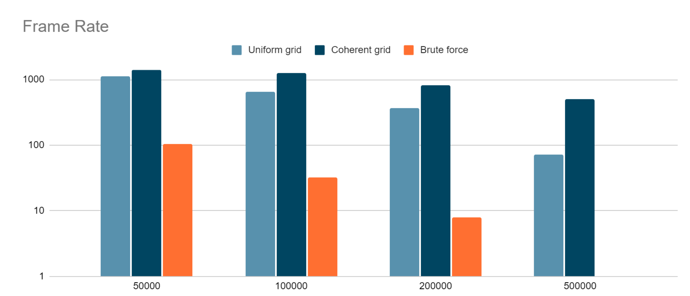

**University of Pennsylvania, CIS 565: GPU Programming and Architecture,
Project 1 - Flocking**

* Penghai Wei
  * [LinkedIn](https://www.linkedin.com/in/penghai-wei)
* Tested on: Windows 11 Build 22000, i9-12900k @ 5.20GHz, RTX 3080ti 12GB

Coherent uniform grid 10000 boids with 0.2 delta time

Coherent uniform grid 50000 boids with 0.2 delta time

Coherent uniform grid 100000 boids with 0.2 delta time

Coherent uniform grid 50000 boids with 0.05 delta time

Coherent uniform grid 100000 boids with 0.05 delta time

Frame Rate Histogram (1-to-1)

Frame Rate Histogram (Logarithmic)

